<h1>Final Project: PETracker</h1>

IoT Workshop - Hebrew University 2020-21

## Authors
Oriyan Hermoni oriyan.hermoni@mail.huji.ac.il , 302170204  
Maya Lulko maya.lulko@mail.huji.ac.il , 312414089

## Package contents:
* README.md
* iot_petracker.sls
* iot_petracker.bin
* project_presentation.pdf

### Run
* To run the python cloud service, use python3.7 and ìnstall the requirements.txt packages - `pip install -r requirements.txt` which is included in the .sls archive. Then run `python cloud_service_demo.py`.
* The .bin hex file can be flashed to the MCU using Simplicity Studio, or the .sls project can be imported and compiled using the same IDE.

<h2>Problem description</h2>

Lost your pet? Well let's find it! With our latest technology we can find your pet anywhere with cellular networks. We do this by connecting your pet's collar to a GPS tracking system & cellular modem. This system updates GPS once in a while and the owner can trigger a distress signal by phone. When the distress signal is received, the GPS sends live location via modem. This location can be tracked live on a map.

<h2>Hardware components</h2>

*   Pearl Gecko EFM32 MCU
*   Quectel L76 GPS connected to MCU via RS232 - using MCU’s LEUART0 (Rx pin only, PD11).
*   Cinterion EHS6 Cellular Modem connected via RS232 to MCU - using MCU’s USART2 configured to async mode (RX/TX using MISO/MOSI pins, PA6 and PA7). 
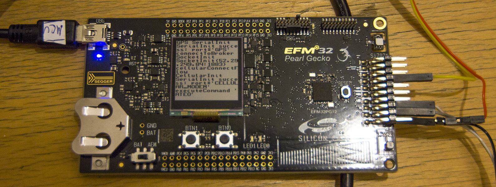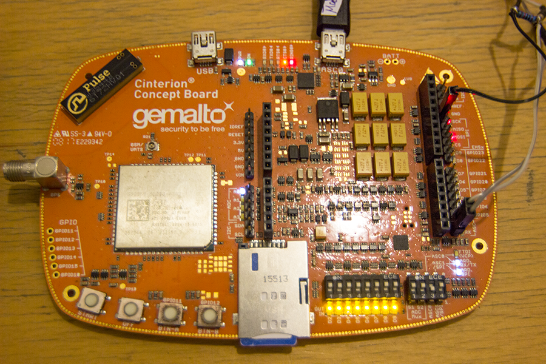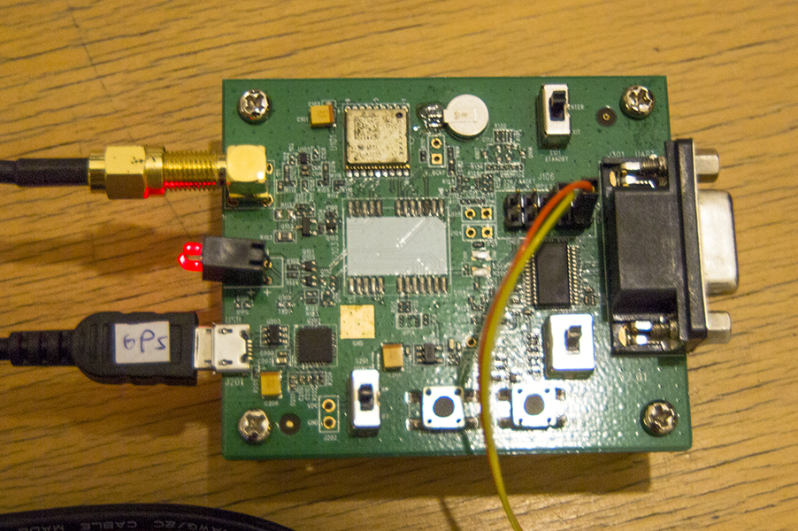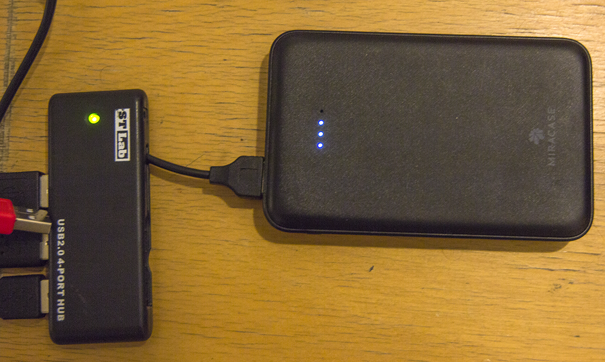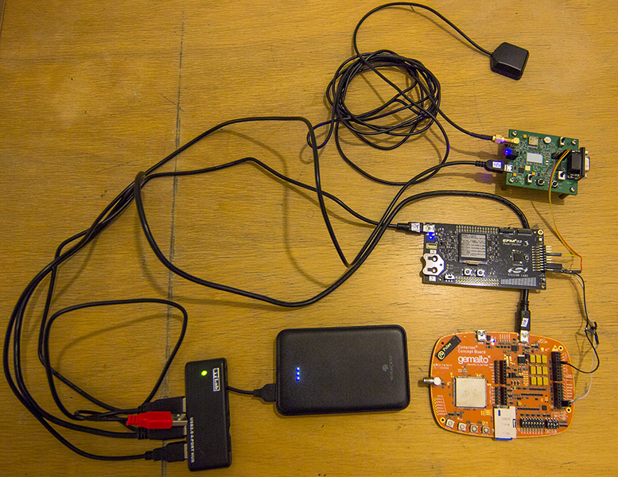

<h2>Application Flow</h2>

<h4>Block Diagram:</h4>

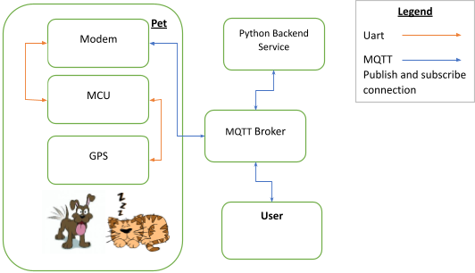

The application flow consists of the following stages (see _Implementation Details_):

1. The GPS sends location data via serial communication which is received by the MCU. 
2. The MCU uses timer interrupts every fixed period of time, reads the data from the GPS and transmits it to the Modem. 
3. Then via Cellular communication, the modem connects to an MQTT broker and publishes the location to a dedicated topic (the **RAW location topic**).
4. The python service is a python script used to visualize the data sent by the IoT device. It is subscribed to the **RAW location topic**, and every time new data is received, it is parsed and visualized on an interactive map displayed in a web browser. Afterwards, the processed data is then sent to a different topic the user is subscribed to (the **location topic**).
5. The user sees the processed data in a format that allows the user to simply copy the data to Google maps and view the location. Additionally, on tap Google maps is opened with the received location.
6. The user can publish a **distress signal **to the MQTT **distress topic** by using a single button press in the phone to trigger more frequent location updates. See **distress mode**.

<h4>Distress mode:</h4>

Distress mode is a state in which the user receives the (almost) real-time location of his/her lost pet. This state is enabled/disabled by publishing an appropriate signal to the **distress topic** via MQTT.

The system can be described in the following state machine:

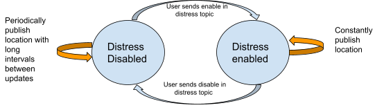

The device has two states: Distress mode **Enabled/Disabled**. If distress mode is **Disabled**, the device will periodically publish location data (for the sake of the demo, we set a period of one minute). If distress mode is **Enabled,** the device will constantly publish the location providing the user with a live feed of his/her pet's location. 

<h2>Implementation details and Features</h2>

<h4>Server Side/Backend (“The cloud”)</h4>

1. **MQTT Broker** - we used the public MQTT broker _broker.mqttdashboard.com, _and used three MQTT topics that connect our three actors (**User, Python Service, **and **IoT Device**)**  **in our flow - 
    1. **Raw Location topic - **“_petracker/location_raw_”, raw location data sent as a short byte sequence.
    2. **Location topic ** - “_petracker/location”, _parsed location data in JSON format.
    3. **Distress topic - _“petracker/distress”, _**distress enable/disable signals are published here.
2. **Python Service **- Runs independently on a Linux/Windows machine connected to the internet. Backend is a python-based service which consists of an MQTT client (implemented with mqtt-paho library) and an HTTP server (implemented with Flask).
    4. **MQTT Client** - Reads raw location data from **Raw Location topic** , and publishes parsed location data in JSON format to **Location topic**.
    5. **Flask HTTP server** - only accessible locally via [http://127.0.0.1:5000](http://127.0.0.1:5000) . Only action allowed is GET to the url “/” which responds with HTML headers. If accessed using a web browser, an interactive map will be rendered with a marker that points to the last known location of the **IoT Device**.
    6. **Interactive Map - **implemented in python using the Folium library, rendering map tiles from OpenStreetMap.
3. **Visualization **- We rendered an interactive map generated by the **Python Service **to see the last known location of the **IoT Device/Tracked pet.**
    7. The folium visualization allows the user to see a live location input visualized by markers on a map. The markers display extended information about the pet’s location, including coordinates, time of location sample in UTC, and more.
    8. The page displaying the map updates every 10 seconds using the last published location, which allows almost real time tracking of the user’s pet, even when in distress mode.

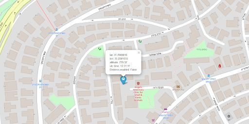

<h4>User side</h4>

1. **Implementation in the Mqtt Dashboard application for Android** -
    1. The app subscribes to the **location topic** where the python script publishes parsed data - “_petracker/location”_. 
    2. Since all location messages are sent with the retain=1, immediately after subscribing the app receives the last known location in a format of the parsed location (python service product).
    3. The app can publish enable/disable signals to the **distress topic**. This is available to the user via switch - See next section.
2. **The User**- There are two visuals in the app in the form of side by side tiles. 
    1. **The location tile**: describing location user friendly in a format of latitude and longitude. By pressing on the tile, Google maps is opened with the current location. 
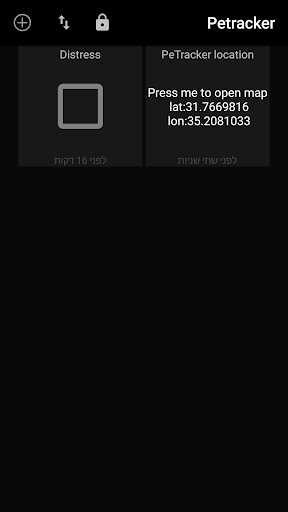  
    2. **The Distress tile:** The user, as previously mentioned, can enable/disable the distress mode. In the app, he/she can do so, by enabling/disabling a switch, which automatically sends its state to the **distress topic **in a form of “enable”/”disable” string read by the IoT device that is subscribed to this topic. The signal is sent once with retain=1. Then, the next time the device subscribes to the **distress topic**, it will enter/exit the distress mode respectively. This means that even if there are connection issues, it won’t matter, since the minute the device is able to subscribe to the distress topic it immediately knows in which states it is, and responds accordingly.      
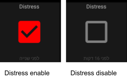

<h4>Power considerations</h4>

We created a basic flow that is adjustable to adding power features that we left for future work. 

In the beginning of the program the MCU initiates the mqtt client. After that it follows the following pseudo code:

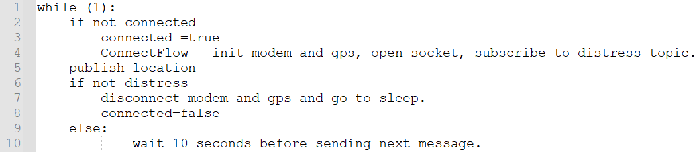

    We can see in line 7 that when not in distress mode, we perform a disconnection sequence of both the modem and gps, followed by “sleep” for a relatively long period of time. We introduced the sleep functionality to simulate the low-power requirements in a real world scenario. In practice, due to hardware limitations we can neither turn off the modem nor the gps. Theoretically, we could switch the modem and gps to low power modes and switch the MCU to one of the built-in energy saving modes (EM2-EM4), leaving a single clock enabled to time the awakening of the device.

<h2>Future work</h2>

1. Enable and implement the power features to optimize the power use of the device, as explained in the previous section.
2. Enable more possible connected devices. Our idea is to use the specific modem’s ccid within the publishing/subscribing topic, allowing unique interface to each device.
3. Since this is a PoC, the prototype cannot physically be placed on a pet, so if it were to be a real product in the market a smaller form factor and more efficient hardware is required.
4. We did not take information security into consideration in our implementation, but we can theoretically encrypt the IoT’s output using TLS, use the ICCID in the topic name to differentiate the device or as a private key hash, as well as forcing user/password authentication for topic subscriptions between all three actors in our scenario.
